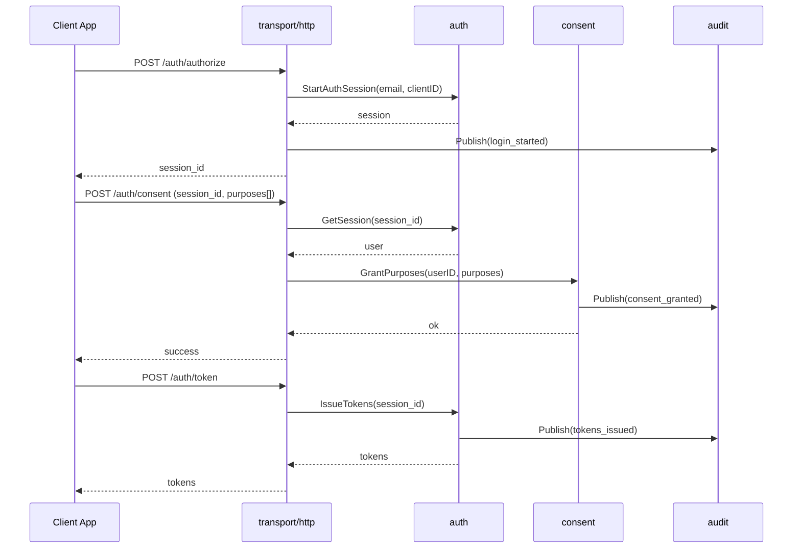
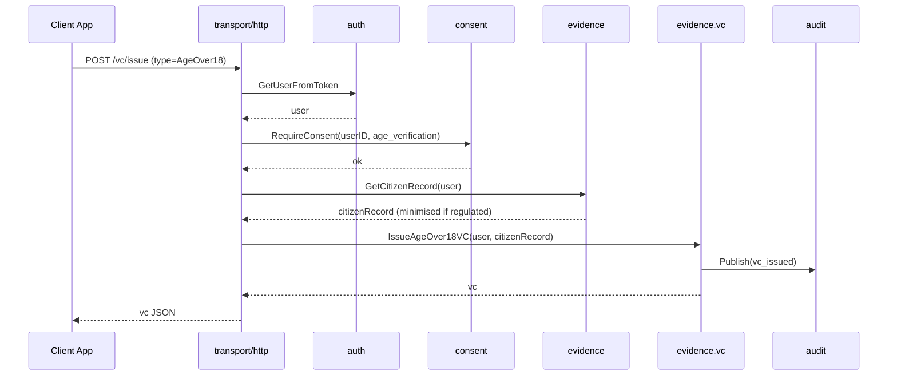
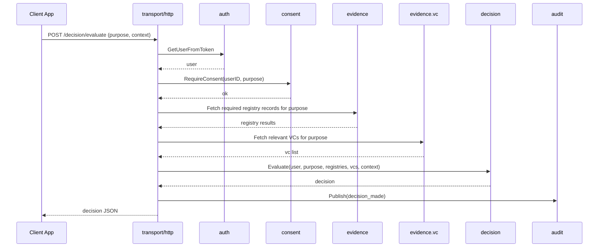
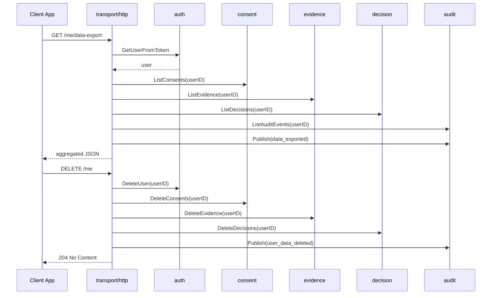

# Identity Verification Gateway - Architecture Documentation

This document describes the architecture of the Identity Verification Gateway: a Go service that simulates regulated identity verification flows, consent, registry checks, and verifiable credentials.

The runtime is a single process (modular monolith), but internal packages are structured along clear service boundaries so that it could be split into microservices later.

## Table of Contents

* [High Level Architecture](#high-level-architecture)
* [Service Boundaries inside the Monolith](#service-boundaries-inside-the-monolith)
* [Package Layout](#package-layout)
* [User Scenarios](#user-scenarios)
* [Component Breakdown](#component-breakdown)

  * [Auth](#auth)
  * [Consent](#consent)
  * [Evidence](#evidence)
  * [Decision](#decision)
  * [Audit](#audit)
  * [Transport HTTP](#transport-http)
  * [Platform](#platform)
* [Core Flows](#core-flows)

  * [Login and Consent](#login-and-consent)
  * [Verification and VC Issuance](#verification-and-vc-issuance)
  * [Decision Evaluation](#decision-evaluation)
  * [Data Export and Deletion](#data-export-and-deletion)
* [Data Model Overview](#data-model-overview)
* [Regulated Mode Behaviour](#regulated-mode-behaviour)
* [Productionisation Considerations](#productionisation-considerations)
* [Design Rationale](#design-rationale)

---

## High Level Architecture

```text
                 ┌────────────────────────────┐
                 │       Client Apps          │
                 │  Demo UI or partner apps   │
                 └─────────────┬──────────────┘
                               │ HTTP
                               ▼
                 ┌────────────────────────────┐
                 │      transport/http        │
                 │    routing and handlers    │
                 └─────────────┬──────────────┘
                               │ calls into services
                               ▼
      ┌─────────────── internal (same process) ─────────────────┐
      │                                                         │
      │  ┌─────────┐  ┌───────────┐  ┌───────────┐  ┌────────┐ │
      │  │  auth   │  │  consent  │  │ evidence  │  │decision│ │
      │  │ users   │  │ purposes  │  │ registry  │  │ engine │ │
      │  │ sessions│  │ lifecycle │  │ vc        │  │ rules  │ │
      │  └────┬────┘  └─────┬─────┘  └─────┬─────┘  └────┬───┘ │
      │       │             │               │             │     │
      │       └──────────┬──┴───────────────┴─────────────┘     │
      │                  ▼                                      │
      │               ┌───────┐                                 │
      │               │ audit │                                 │
      │               │ queue │                                 │
      │               └──┬────┘                                 │
      │                  ▼                                      │
      │              storage layer                              │
      └─────────────────────────────────────────────────────────┘

                       ▼
                Observability, logs
```

Everything runs in one binary, but each internal package has a clear responsibility and limited dependencies.

---

## Service Boundaries inside the Monolith

If this system were split into microservices, reasonable boundaries would be:

1. **Auth Service**
   Users and sessions, OIDC lite login, tokens, userinfo.

2. **Consent and Policy Service**
   Purpose based consent, consent lifecycle, policy rules.

3. **Evidence Service**
   Registry checks (citizen, PEP sanctions), verifiable credential issuance and verification.

4. **Decision Service**
   Decision engine that combines evidence, purpose, and context.

5. **Audit Service**
   Append only audit log, queue consumer, durable audit storage.

In the monolith, each of these is a package with a narrow API. The process is single, the boundaries are logical.

---

## Package Layout

Suggested layout aligned with those boundaries:

```text
internal/
  platform/
    config/         # configuration loading
    logger/         # logging abstraction
    httpserver/     # shared HTTP server setup
  auth/
    service.go      # Users, sessions, tokens
    store.go        # UserStore, SessionStore
    models.go
  consent/
    service.go      # Grant, revoke, RequireConsent
    store.go
    models.go
  evidence/
    registry/
      client_citizen.go    # citizen registry mock
      client_sanctions.go  # sanctions registry mock
      service.go           # RegistryService, caching, minimisation
      store.go             # RegistryCacheStore
      models.go
    vc/
      service.go           # VCService
      store.go             # VCStore
      models.go
  decision/
    service.go      # Evaluate decisions
    store.go        # DecisionStore
    models.go
  audit/
    publisher.go    # queue or channel publisher
    worker.go       # background consumer
    store.go        # AuditStore
    models.go
  transport/
    http/
      router.go
      handlers_auth.go
      handlers_consent.go
      handlers_evidence.go
      handlers_decision.go
      handlers_me.go
cmd/
  server/
    main.go         # wires everything together
```

Rules of thumb:

* `transport/http` depends on services only, not on storage details.
* Services depend on their own stores and on other services through interfaces, not on handlers.
* `audit` is a shared dependency all services can call to emit events.
* `platform` provides cross cutting plumbing such as config and logging.

---

## User Scenarios

The main user scenarios are unchanged, but thinking in terms of the new boundaries helps.

### Scenario 1 - Fintech age verification for onboarding

* Auth service logs the user in and issues tokens.
* Consent service records consent for `age_verification`.
* Evidence service calls citizen registry, derives `is_over_18`, issues an `AgeOver18` VC.
* Decision service uses registry evidence and VC to return `pass`.
* Audit service records login, consent, registry query, VC issuance, and decision.

### Scenario 2 - Sanctions check for high risk operation

* Auth service identifies current user via access token.
* Consent service verifies consent for `sanctions_screening`.
* Evidence service calls sanctions registry and returns `IsPep`, `IsSanctioned`.
* Decision service returns `fail` or `pass_with_conditions` based on policy.
* Audit service records the decision with reason.

### Scenario 3 - Data export and deletion for user rights

* Auth service identifies user.
* Consent, evidence, decision, and audit services expose read methods via their stores to gather all data for the user.
* Transport layer exposes `/me/data-export` and `/me` on top of these services.
* Audit service records `data_exported` and `user_data_deleted` events.

---

## Component Breakdown

### Auth

**Responsibilities**

* Manage `User` and `Session` objects.
* Implement minimal OIDC like behaviour: authorize, token, userinfo.
* Provide a helper to resolve the current user from an access token for other services.

**Key types**

```go
type User struct {
    ID          string
    Email       string
    DisplayName string
}

type Session struct {
    ID        string
    UserID    string
    ClientID  string
    ExpiresAt time.Time
}
```

**Clients**

* Called by `transport/http` for login and token endpoints.
* Called by `transport/http` to resolve current user for any authenticated endpoints.

---

### Consent

**Responsibilities**

* Model purpose based consent as first class data.
* Enforce consent requirements before sensitive operations.
* Provide a stable enforcement API used by other services.

**Key types**

```go
type ConsentRecord struct {
    ID        string
    UserID    string
    Purpose   string
    GrantedAt time.Time
    ExpiresAt *time.Time
    RevokedAt *time.Time
}
```

**Services**

* `GrantPurposes(userID, purposes)`
* `RequireConsent(userID, purpose)` returns typed errors `ErrMissingConsent`, `ErrConsentExpired`.

**Clients**

* Called by `transport/http` on `/auth/consent`.
* Called by `evidence` and `decision` services to enforce requirements.

---

### Evidence

Evidence is split into `registry` and `vc`.

#### Registry

**Responsibilities**

* Integrate with citizen and sanctions registry mocks.
* Cache results with TTL.
* Apply minimisation when regulated mode is active.

**Key types**

```go
type CitizenRecord struct {
    FullName  string
    DOB       time.Time
    IsOver18  bool
}

type SanctionsRecord struct {
    IsPep        bool
    IsSanctioned bool
    RiskScore    int
}
```

**Service**

* `GetCitizenRecord(user)`
* `GetSanctionsRecord(user)`

This service is the only place that knows about external registry details.

#### VC

**Responsibilities**

* Issue and verify simple verifiable credentials such as `AgeOver18`.
* Store and revoke credentials.

**Key types**

```go
type VerifiableCredential struct {
    ID       string
    UserID   string
    Type     string
    Issuer   string
    IssuedAt time.Time
    Claims   map[string]any
    Revoked  bool
}
```

**Service**

* `IssueAgeOver18VC(user, citizenRecord)`
* `Verify(vcID)`

---

### Decision

**Responsibilities**

* Combine purpose, user, evidence, and context into a decision.
* Encapsulate business rules for `age_verification`, `sanctions_screening`, and any other purposes.

**Key types**

```go
type DecisionStatus string

const (
    DecisionPass              DecisionStatus = "pass"
    DecisionPassWithConditions               = "pass_with_conditions"
    DecisionFail                             = "fail"
)

type Decision struct {
    ID         string
    UserID     string
    Purpose    string
    Status     DecisionStatus
    Reason     string
    Conditions []string
    CreatedAt  time.Time
}
```

**Service**

* `Evaluate(EvaluateInput) (*Decision, error)`

`EvaluateInput` includes `User`, `Purpose`, and a generic `Context` map for client specific information, for example transaction amount.

---

### Audit

**Responsibilities**

* Provide a simple API for other services to publish audit events.
* Decouple publishing from persistence using a queue or Go channel.
* Persist events in an `AuditStore` and log them.

**Key types**

```go
type AuditEvent struct {
    ID        string
    ActorID   string
    SubjectID string
    Action    string
    Purpose   string
    Decision  string
    Reason    string
    Timestamp time.Time
    RequestID string
}
```

**Components**

* `AuditPublisher` interface for publishing events.
* Channel based implementation for the prototype.
* Worker that drains the channel and writes to `AuditStore`.

**Clients**

* Called by auth, consent, evidence, decision, and transport layers when key actions occur.

---

### Transport HTTP

**Responsibilities**

* Expose REST endpoints.
* Marshal and unmarshal JSON.
* Handle errors and HTTP status codes.
* Call into services only, no business rules.

Key handlers grouped by file, for example:

* `handlers_auth.go` for `/auth/*` endpoints.
* `handlers_consent.go` for `/auth/consent`.
* `handlers_evidence.go` for `/vc/*` or registry endpoints if you expose them.
* `handlers_decision.go` for `/decision/evaluate`.
* `handlers_me.go` for `/me/data-export` and `/me`.

---

### Platform

**Responsibilities**

* Cross cutting concerns, not domain logic.

Typical contents:

* Config loading (environment variables, flags).
* Logger initialisation.
* HTTP server startup and graceful shutdown.

---

## Core Flows

The flows are similar to the earlier version, but now you can see clearly which internal services are involved.

### Login and Consent



---

### Verification and VC Issuance



---

### Decision Evaluation



---

### Data Export and Deletion



---

## Data Model Overview

High level entities across services:

* `auth`

  * `User`
  * `Session`

* `consent`

  * `ConsentRecord`

* `evidence.registry`

  * `CitizenRecord`
  * `SanctionsRecord`
  * `RegistrySnapshot` (if you add it as persistent type)

* `evidence.vc`

  * `VerifiableCredential`

* `decision`

  * `Decision`

* `audit`

  * `AuditEvent`

These are joined by `UserID` and purpose strings.

---

## Regulated Mode Behaviour

`REGULATED_MODE=true` should affect behaviour across services, not just one:

* `auth`
  Same, but you might choose stricter session duration.

* `consent`
  Mandatory for registry, VC, and decision flows. Missing consent returns a hard failure.

* `evidence.registry`
  Minimises data. Derives attributes like `IsOver18` then discards full DOB after use or keeps it under strict TTL.

* `evidence.vc`
  Uses derived attributes as claims instead of raw PII where possible.

* `decision`
  May enforce stricter rules for certain purposes.

* `audit`
  Required for all sensitive operations. No best effort logging.

Having the code structured by services makes these toggles easier to reason about.

---

## Productionisation Considerations

Key improvements if you wanted to harden this design:

* Replace in memory stores with Postgres based repositories per service.
* Replace channel based audit publisher with a real queue and an audit worker deployment.
* Replace OIDC lite with a real OIDC provider.
* Add metrics and tracing around service boundaries.
* Introduce a policy engine for decisions and retention logic.

The boundaries already match likely service splits, so you can talk about how you would pull `auth`, `consent`, `evidence`, `decision`, and `audit` out into separate deployable services if needed.

---

## Design Rationale

* The monolith avoids early distributed systems complexity while still modelling realistic identity flows.
* Internal packages map to clear business responsibilities, so the code is explainable in interviews.
* The separation of auth, consent, evidence, decision, and audit reflects how regulated environments are usually structured in practice, even when everything runs on one platform.