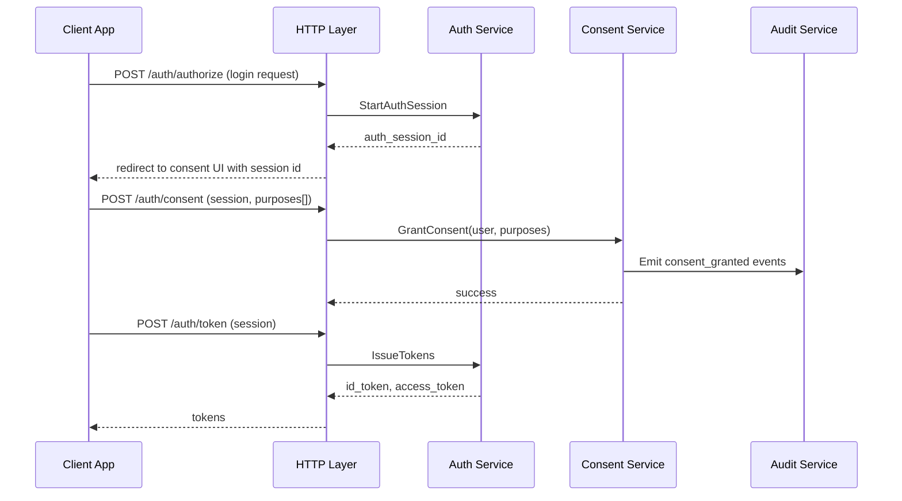
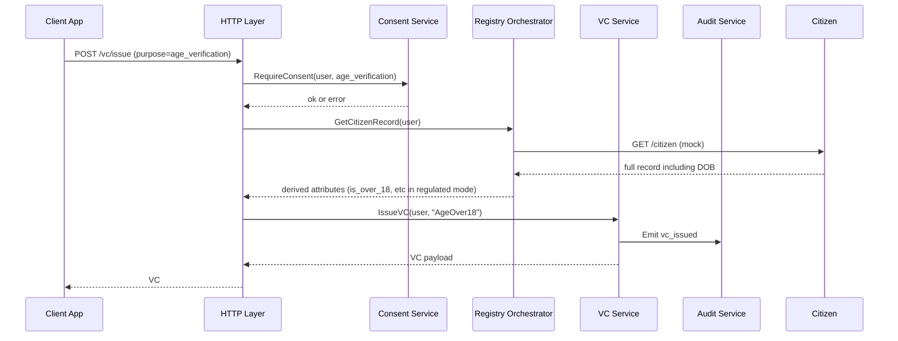
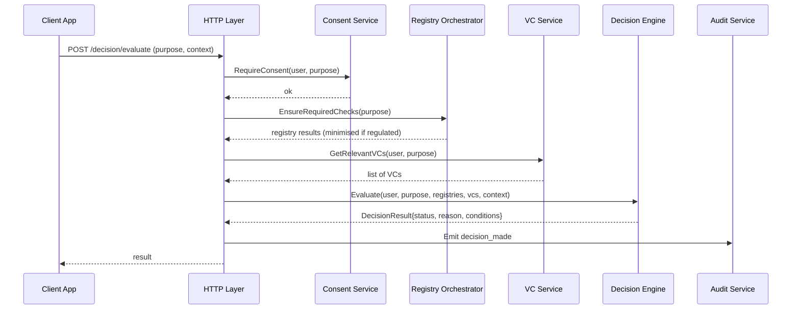
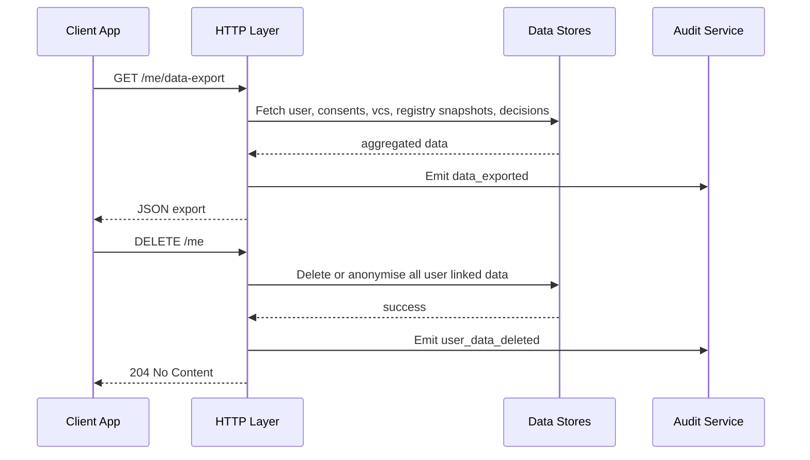
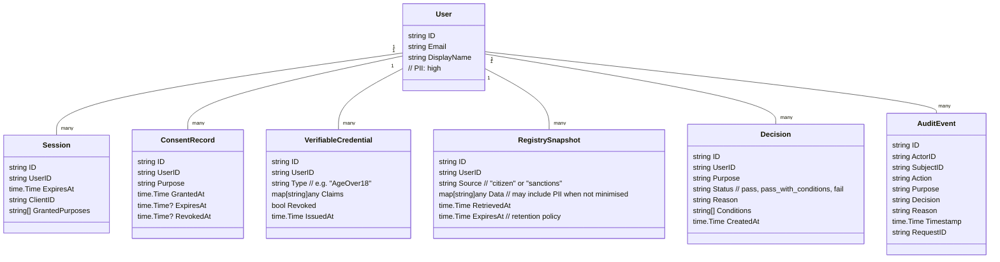

# Identity Verification Gateway - Architecture Documentation

This document describes the architecture of the Identity Verification Gateway: a small Go service that simulates regulated identity verification flows, consent, registry checks, and verifiable credentials.

## Table of Contents

* [High Level Architecture](#high-level-architecture)
* [User Scenarios](#user-scenarios)
* [Component Breakdown](#component-breakdown)
* [Core Flows](#core-flows)

  * [Login And Consent Flow](#login-and-consent-flow)
  * [Verification And VC Issuance](#verification-and-vc-issuance)
  * [Decision Evaluation Flow](#decision-evaluation-flow)
  * [Data Export And Deletion](#data-export-and-deletion)
* [Data Model](#data-model)
* [Regulated Mode Behaviour](#regulated-mode-behaviour)
* [Design Rationale](#design-rationale)

---

## High Level Architecture

```text
                 ┌────────────────────────────┐
                 │        Web Client          │
                 │  (Demo UI or partner app)  │
                 └─────────────┬──────────────┘
                               │ HTTPS
                               ▼
                 ┌────────────────────────────┐
                 │        HTTP API Layer      │
                 │  routing, DTOs, handlers   │
                 └─────────────┬──────────────┘
                               │ calls
                               ▼
                 ┌────────────────────────────┐
                 │       Domain Services      │
                 │  auth, consent, registry   │
                 │  vc, decision, policy      │
                 └─────────────┬──────────────┘
                               │ interfaces
                               ▼
       ┌────────────────────────┴───────────────┐
       │                                        │
┌──────────────┐                        ┌────────────────┐
│ Storage      │                        │ External Mocks │
│ in memory    │                        │ (Registries)   │
│ Users,       │◄─────────────┐         │ Citizen,       │
│ Sessions,    │              │         │ Sanctions      │
│ Consent, VCs │              │         └────────────────┘
│ Audit, Cache │              │ HTTP
└──────────────┘              │
                              │ audit events
                              ▼
                    ┌────────────────────┐
                    │   Audit Sink       │
                    │  structured logs   │
                    └────────────────────┘
```

Key principles:

1. Clear separation between HTTP, domain logic, storage, and external systems.
2. Domain layer owns consent, privacy, and policy rules.
3. All sensitive operations emit structured audit events.
4. Regulated mode can tighten behaviour without changing high level design.

---

## User Scenarios

### Scenario 1 - Age Verification For A Fintech Onboarding

1. A user initiates onboarding in a fintech app that uses this gateway.
2. The app redirects to the gateway's login and consent screen.
3. User authenticates and grants consent for purpose `age_verification`.
4. Gateway calls the citizen registry mock, obtains full record including DOB.
5. Domain logic computes `is_over_18` and discards the raw date in regulated mode.
6. A verifiable credential "AgeOver18" is issued to the user.
7. A decision evaluation returns `pass` for the onboarding request.
8. All steps are logged as audit events.

Demonstrates: regulated identity flow, consent, data minimisation, VC, decision.

---

### Scenario 2 - Sanctions Check Fails For High Risk Operation

1. A logged in user attempts a "high value transfer" in the client app.
2. The client calls `/decision/evaluate` with a purpose `sanctions_screening`.
3. Gateway verifies that consent for this purpose exists and is not expired.
4. Sanctions registry mock returns `pep_match=true`.
5. Decision engine returns `fail` with reason "sanctions_screening_failed".
6. Audit log includes user, purpose, decision, and justification.

Demonstrates: regulated domain risk control, purpose based consent, decision reasoning.

---

### Scenario 3 - Data Export And Right To Be Forgotten

1. User visits the settings section in the demo UI.
2. They request a data export via `/me/data-export`.
3. Gateway aggregates data for that user from user, consent, VC, registry cache, and decisions.
4. User inspects the JSON export.
5. User requests deletion via `/me`.
6. Gateway deletes or anonymises all records and emits an `user_data_deleted` audit event.

Demonstrates: GDPR style rights, lifecycle control, auditability.

---

## Component Breakdown

### 1. HTTP API Layer (`internal/http`)

Responsibilities:

* Define routes and DTOs.
* Parse and validate requests.
* Map domain errors to HTTP responses.
* Never contain business rules about consent or decisions.

Key routes:

* Auth and userinfo

  * `POST /auth/authorize`
  * `POST /auth/consent`
  * `POST /auth/token`
  * `GET /auth/userinfo`

* Verification and registry

  * `POST /registry/citizen`
  * `POST /registry/sanctions`

* VC lifecycle

  * `POST /vc/issue`
  * `POST /vc/verify`

* Decision and user rights

  * `POST /decision/evaluate`
  * `GET /me/data-export`
  * `DELETE /me`

Error behaviour:

* 400 for validation failures.
* 403 for missing or invalid consent.
* 422 for business rule violations that the client can fix.
* 500 for internal failures.

---

### 2. Domain Services (`internal/domain` and subpackages)

Subcomponents:

* `auth`

  * Manages mock OIDC sessions, tokens, and user identity attributes.
  * Provides `GetCurrentUser(ctx)` that the rest of the domain uses.

* `consent`

  * Models `ConsentRecord` with purpose, granted_at, expires_at, revoked_at.
  * Provides `RequireConsent(userID, purpose)` that returns typed errors if consent is missing.

* `registry`

  * Orchestrates calls to citizen and sanctions clients.
  * Applies regulated mode rules on returned data (minimisation).
  * Uses a cache store with TTL.

* `vc`

  * Manages VC issuance and verification for simple credential types such as `AgeOver18`.
  * Stores and revokes credentials via VCStore.

* `decision`

  * Combines identity attributes, registry outputs, and VCs to return `DecisionResult`.
  * Examples: `pass`, `pass_with_conditions`, `fail`.
  * Returns `reason` and optional `conditions[]`.

* `policy`

  * Holds retention rules and mapping from purposes to required checks.
  * Example: `age_verification` requires citizen registry, `sanctions_screening` requires sanctions registry.

Each service:

* Depends only on interfaces of storage and external clients.
* Emits domain level audit events, not raw logs.

---

### 3. Storage Layer (`internal/storage`)

In memory implementations initially, with clear interfaces.

Stores:

* `UserStore` - Users and basic profile.
* `SessionStore` - OIDC sessions, tokens, expiry.
* `ConsentStore` - Consent records keyed by user and purpose.
* `VCStore` - Stored verifiable credentials and revocation status.
* `RegistryCacheStore` - Cached registry snapshots with TTL.
* `DecisionStore` - Optional, store previous decisions for audit.
* `AuditStore` - In memory append only list or log writer.

Each store interface is intentionally small and speaks in domain types. This keeps it trivial to swap to Postgres if you want later.

---

### 4. External Registry Clients (`internal/registry/client`)

Two mocked external systems:

* `CitizenRegistryClient`

  * Returns records that include PII such as full name and date of birth.
  * Introduces configurable artificial latency and occasional failure codes.

* `SanctionsRegistryClient`

  * Returns flags such as `pep_match`, `sanctions_listed`.
  * Also simulates latency and errors.

These clients never leak directly into handlers. The domain layer wraps them to apply purpose based and regulated mode rules.

---

### 5. Audit Layer (`internal/audit`)

Centralised audit service:

* Accepts an `AuditEvent` structure from domain services.
* Appends to in memory store and logs to standard output for now.
* Events include:

  * `actor_id` (user or client)
  * `action` (login, consent_granted, registry_query, vc_issued, decision_made, data_exported, data_deleted)
  * `purpose` (where relevant)
  * `subject_id` (who the data relates to)
  * `decision` and `reason` (if applicable)
  * `timestamp` and `request_id`.

This gives you a concrete talking point about auditability in regulated environments.

---

## Core Flows

### Login And Consent Flow



Key points:

* Consent is explicit and purpose based.
* Tokens are not issued until consent is recorded.
* Consent grant is auditable.

---

### Verification And VC Issuance



In regulated mode the domain layer should drop raw DOB once `is_over_18` is derived.

---

### Decision Evaluation Flow



Purposes can be mapped to required checks. For example:

* `age_verification` → citizen registry only
* `sanctions_screening` → sanctions registry only
* `full_kyc` → both registries and presence of certain VCs.

---

### Data Export And Deletion



This flow is intentionally simple but gives you a handle to talk about user rights in regulated domains.

---

## Data Model

High level domain entities. Initial implementation can be structs plus in memory maps.



You can annotate fields in code with comments for PII classification, for example:

```go
type CitizenRecord struct {
    // PII high - subject to strict retention
    FullName string
    DOB      time.Time

    // Derived attributes - safer to retain
    IsOver18 bool
}
```

---

## Regulated Mode Behaviour

When `REGULATED_MODE=true`:

* Consent is mandatory for any registry, VC, or decision call.
* Registry results are reduced to minimal necessary attributes for the requested purpose.
* Raw PII is not stored beyond short lived registry snapshots, which have strict TTL.
* Audit events are required for all sensitive operations.
* Some operations may fail hard if required consent or data minimisation rules are not met.

When `REGULATED_MODE=false`:

* The same flows work, but the system may store richer data and run in a more relaxed demo mode.
* This lets you contrast sandbox behaviour with regulated aware behaviour in interviews.

---

## Design Rationale

1. **Separation of HTTP and domain logic**
   You avoid pushing complex consent or decision logic into handlers. This keeps testability and makes it easy to reason about regulatory controls as pure domain functions.

2. **Purpose based consent as first class concept**
   Consent is not a boolean on the user. It is a separate object keyed by purpose with its own lifecycle. This mirrors real financial and health flows.

3. **Data minimisation and derived attributes**
   The system shows a clear example of how to derive a safe attribute, such as `is_over_18`, then discard or tightly retain the original PII. This is a concrete demonstration of privacy by design.

4. **Explicit audit events**
   Every meaningful step in a regulated flow results in a structured audit event. This is what compliance and risk teams care about and gives you discussion material on monitoring and incident investigation.

5. **TTL driven registry cache**
   Registry snapshots are not kept forever. They expire according to a policy. This gives you a way to talk about data retention strategies and staleness risks.

6. **Regulated mode toggle**
   The configuration flag allows you to demonstrate how the same architecture can serve both sandbox clients and more constrained regulated environments. It lets you talk about progressive hardening and feature gating.

7. **In memory stores first, interfaces ready for databases**
   Starting with in memory implementations keeps the project small enough to build quickly, while the clean interfaces let you describe how you would move to a real data store in production.
